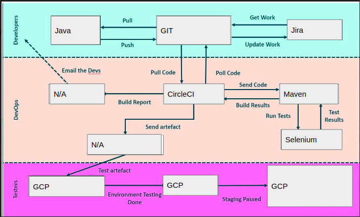

# Fundamental_Project
This is the Repo for my first SFIA project at the Academy. 

# Shopping list web application

## Resources
* Presentation: [Click here](https://docs.google.com/presentation/d/1mb8KoRhpG-OuJ1POmKj7klb5A0CG5vYyM1I8YBRJKqY/edit?usp=sharing)
## Contents 
* [Overview](#overview)
   * [Brief](#brief)
   * [Requirements](#requirements)
   * [About the application](#about-the-application)
* [Documentation](#documentation)
   * [Kanban board](#kanban-board)
   * [User stories](#user-stories)
   * [MoSCoW prioritization](#MoSCoW-prioritization)
   * [ERD](#erd)
   * [CI Pipeline](#ci-pipeline)
* [Tools used](#tools-used)
* [Risk Assessment](#risk-assessment)
* [Testing](#testing)
   * [Unit testing](#unit-testing)
* [Issues](#issues)
   * [Future Improvements](#future-improvements)
## Overview
### Brief
The brief for this application is the following: To create a CRUD application with the utilisation of supporting tools, methodologies and technologies that encapsulate all core modules covered during training.
### Requirements
The requirements for the application are the following:
- A Jira board with full expansion on user stories, use cases and tasks needed to complete the project.
- Clear Documentation from a design phase describing the architecture you will use for your project.
- A detailed Risk Assessment created at the beginning of your project.
- A relational database used to store data persistently for the project.
- A functional application created in the OOP language, following best practices and design principles, that you have covered during training, this application needs to meet the requirements set on your Kanban Board
- The application must have a functioning front-end website and integrated API.
- Fully designed test suites for the application you are creating, as well as automated tests for validation of the application.
- You must meet an acceptable level of test coverage in your backend and provide consistent reports and evidence that you have done so.
- Code fully integrated into a Version Control System
- Code built through a CI server
- Application deployed to a cloud-based virtual machine
### About the application 
This web application is a shopping list with CRUD functionality implemented in Java on the backend and HTML, CSS and JavaScript on the frontend. It allows the user to:
- Create new shopping list items 
- Read all shopping list items 
- Update shopping list items
- Delete shopping list items
## Documentation
Tip: Click on screenshots to view them
### Kanban board 
You can find a screenshot of the Kanban board built on Jira below:

Backlog: 

### User Stories

### MoSCoW Prioritization 

### ERD 
Initially the ERD was going to look like:

It was changed slightly to allow more flexibility and create more useful table relationships. The final ERD for this project is below: 

### CI Pipeline
You can view the Continuous Integration Pipeline for this project below:

## Tools used
- GCP
- Jira 
- IntelliJ Idea Ultimate Edition
- Postman 
## Risk assessment
The risk assessment for this project can be found [here](https://docs.google.com/spreadsheets/d/1FZ0upgjej-PR6DOzRNrYEeQYHSlggi4H1xdrt9gCWvM/edit?usp=sharing)
## Testing 
### Unit testing
- DTO classes were unit tested to ensure each constructor, method, etc, worked properly. 
## Issues 
- No issues to report for this project. This project has been great experience.
### Future improvements
- Add login and register functionality for personalized shopping lists
## Authors/Contributors
Author: Macaulay Farrell, the only contributor was Macaulay Farrell for this project.

